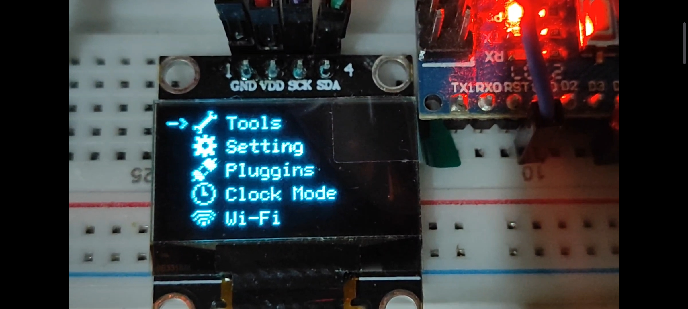
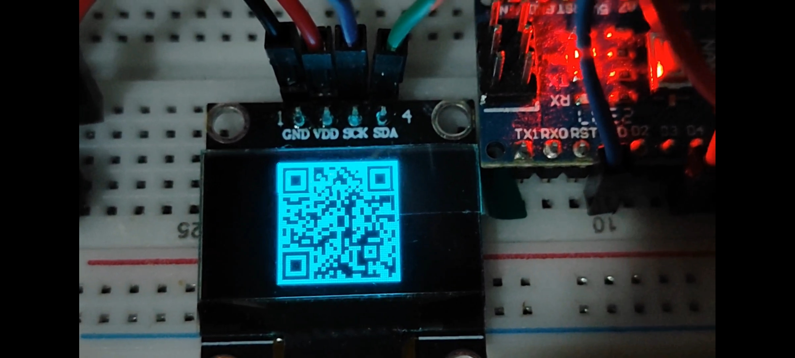
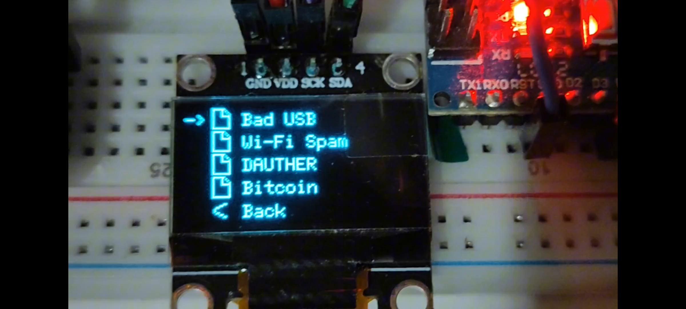

# Flipper-Ino-A03

## Donate Me At
- `bitcoin`: bc1q0dl24vs9w3rkpwplc9wwlhh0qpglu26esw3mrq
  
## What is it?
A firmware to simulate Flipper Zero firmware; it's only for study purposes, but you can do real functions with it.
This is an experimental project, it is in the early stages, and I intend to improve it so that we can work with cybersecurity in an inexpensive and comprehensive manner.

## Requirements To Compile
- U8glib [by oliver]
- Vector [by Peter Polidoro]
- arduino-cli [by Arduino] (necessário)

## Compiling for Arduino Nano ATmega328P (Windows 10)
```shell
arduino-cli.exe compile -b arduino:avr:nano --library .\include --upload -p COM3 --clean
```

## Screenshots



